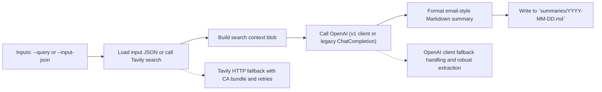
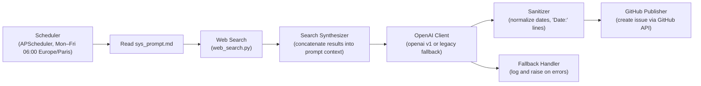

# os_daily
Daily Open Science updates

Check the `.md` files in the `/summaries` folder [here](https://github.com/caggursoy/os_daily/tree/main/summaries)

## Tavily Summary Script Visualisation

Mermaid diagram for the `scripts/tavily_summary.py` workflow:



ASCII fallback (for environments without Mermaid rendering):

```
Inputs (--query or --input-json)
	|
	v
Load input JSON -> Tavily search (with client or HTTP fallback)
	|
	v
Build search context blob -> Call OpenAI (v1 or legacy fallback)
	|
	v
Format email-style Markdown -> Write to `summaries/YYYY-MM-DD.md`
```

Usage notes for `scripts/tavily_summary.py`:

- **Env vars:** `TAVILY_API_KEY`, `OPENAI_API_KEY` (optional: `TAVILY_API_URL`, `OPENAI_MODEL`, `TAVILY_CA_BUNDLE`)
- **Run locally:** `python scripts/tavily_summary.py --query "your query"`
- **Use example input:** `python scripts/tavily_summary.py --input-json example_input.json`


## Daily Agent Visualization **(deprecated)**

Below is a simple visualization and explanation of the agent implemented in `scripts/run_sys_prompt_agent.py`.

Mermaid diagram (GitHub will render this when enabled):



ASCII fallback (for environments without Mermaid):

```
Scheduler (APScheduler, Mon-Fri 06:00 Europe/Paris)
		|
		v
Read `sys_prompt.md` -> Web Search -> Search Synthesizer -> OpenAI Client (v1 or legacy)
		|
		v
	Sanitizer (normalize dates)
		|
		v
GitHub Publisher (create issue via API)
```

Key components:

- **Scheduler:** Runs the job on weekdays at 06:00 Europe/Paris using `apscheduler`.
- **Reader:** Loads the system prompt from `sys_prompt.md`.
- **Web Search:** Performs a freshness-focused web search (`web_search.py`) to gather recent open-science items.
- **Search Synthesizer:** Concatenates titles/snippets/URLs into a compact context block prepended to the system prompt.
- **OpenAI Client:** Calls OpenAI (supports `openai>=1.0.0` client or legacy `ChatCompletion` fallback).
- **Sanitizer:** Normalizes headings/date lines to prevent hallucinated dates in issues.
- **GitHub Publisher:** Creates an issue in the repository specified by the `GITHUB_REPO` env var using `GITHUB_TOKEN`.

Usage notes:

- Set environment variables in a `.env` file or system env: `OPENAI_API_KEY`, `GITHUB_TOKEN`, `GITHUB_REPO`.
- Run once: `python scripts/run_sys_prompt_agent.py --once`.
- Run scheduler: `python scripts/run_sys_prompt_agent.py`.

